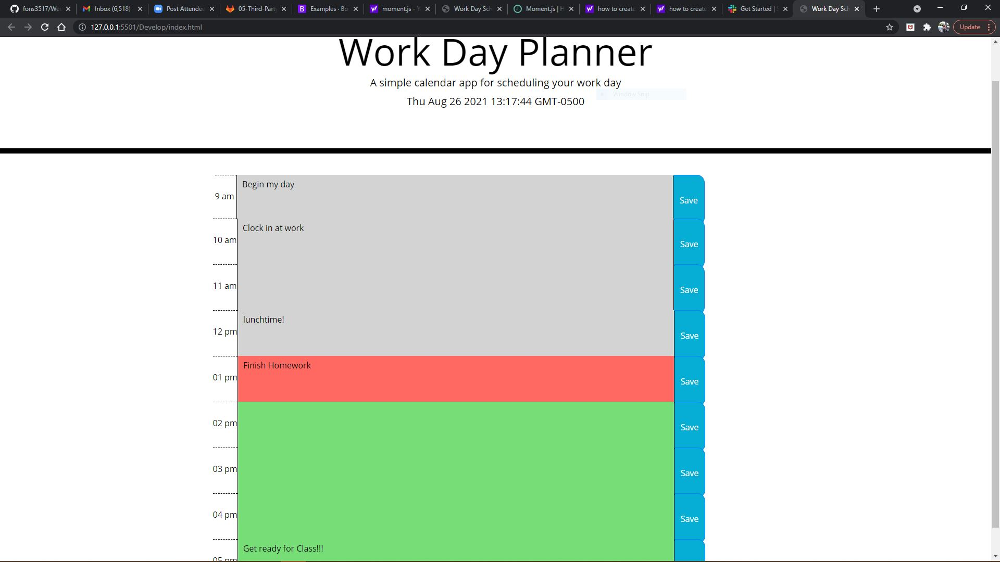

# Work Day Planner

* Due date: 08/28/2021

## Word Day Planner:

* Work Day Planner is a scheduling mechanism that allows you to plan your day using color-coded timeblocks for past, present and future events. Moment.js has been incorporated and utilized for the timescheme and date.

### Link to deployed site; screenshot of up-to-date site included.

* [WeekDayPlanner](https://fons3517.github.io/WeekDayPlanner/)

* 
